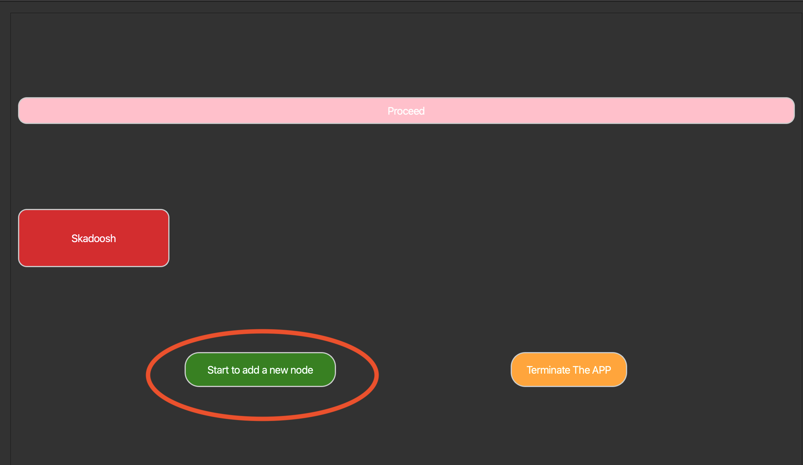
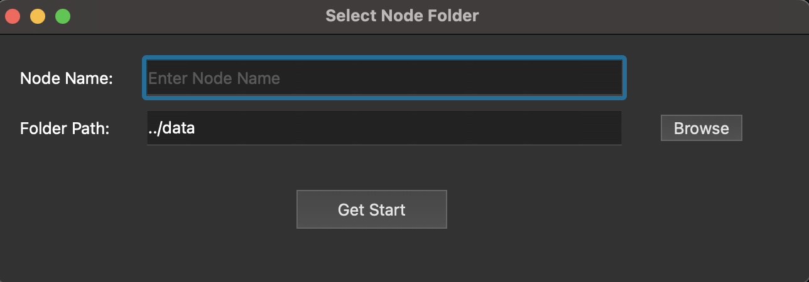
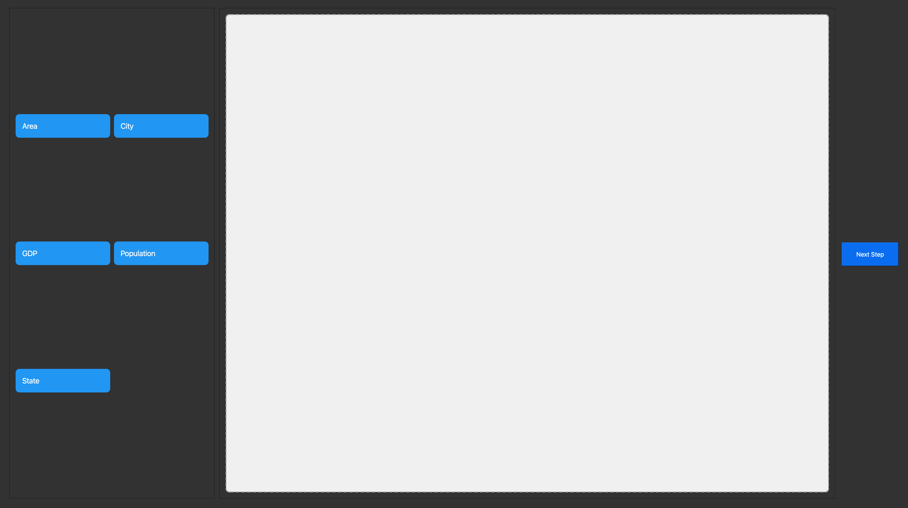
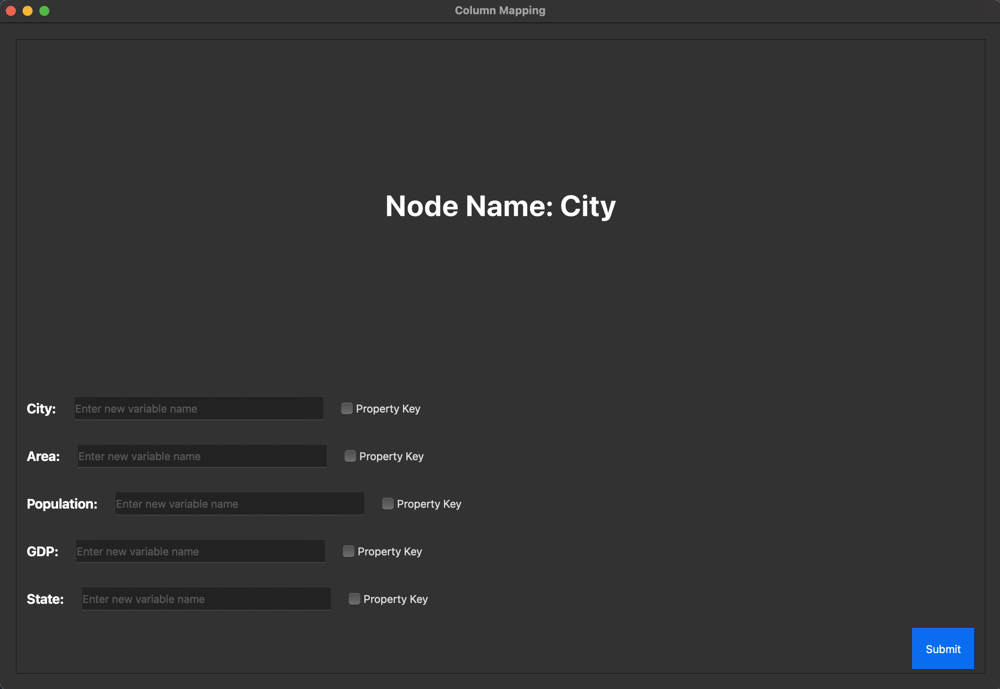
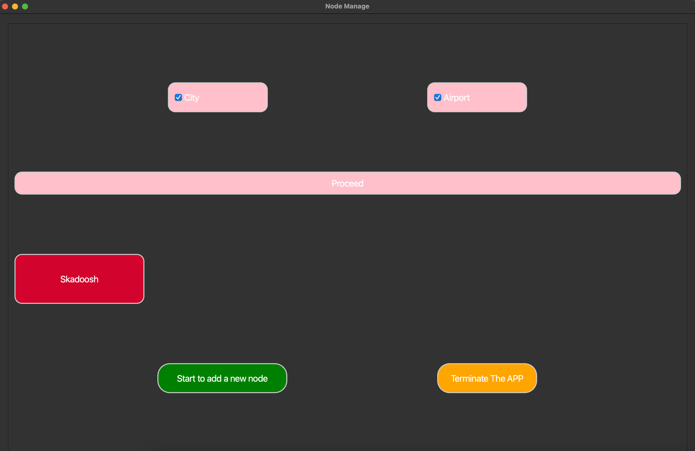
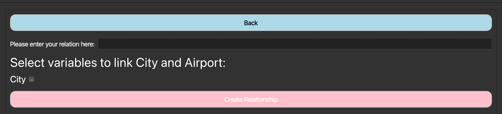

# Graph2Neo4jDB: Import your CSV, build your Neo4j graph, and link nodes—your way!

#### **Graph2Neo4jDB2.0 is a tool for importing CSV data into Neo4j and building your own knowledge graph.**

It features a simple UI and essential functions, with new features continuously in development.

## **Current Features**

All features are supported by a simple UI—so you don’t have to write code every time you import nodes.

1. **Batch Import for Similar CSVs** – Import multiple CSV files for the same node type.
2. **Build Node Relationship** – Define and customize relationships between nodes.
3. **One-Click (Skadoosh) Bulk Import** – Import large datasets with just one action.
4. **Under Construction...** 🚧 (More features coming soon!)

---

## Setup before running

1. Add the Neo4j credentials to `.streamlit/secrets.toml` (place them inside the `src` directory).

2. Create a new Neo4jGraph instance using these credentials

3. Set your own graph info in the `serects.toml`

```toml
NEO4J_URI = "bolt://54.234.52.23:7687"
NEO4J_USERNAME = "neo4j"
NEO4J_PASSWORD = "your_password"
```

---

## 📥 **Ⅰ. Import Your Own Node**

### 🛠 **① Add a New Node**

Click **"Add New Node"** to select a CSV folder and define the node name.



📂 **Default Folder:** `'data'` inside the project directory.



### ⚠️ **Important**

The selected folder must contain CSV files of the **same node type**.
For example, importing **City** nodes means your folder should contain:
🗽 `NewYork.csv`, 🌆 `Chicago.csv`, etc.

The tool automatically extracts the **common column names** from all CSVs and displays them in the UI.</span>

---

### 🎯 **② Select Your Data Fields**

Drag column labels into the **white box** to define node attributes.

After clicking **'Next Step'**, the system will create a folder in `cache/` with the **same name** as your node.
A **`path.json`** file will store the required data paths, enabling **one-click generation** in the future.

⚠ **Check the `cache` folder to avoid duplicate names.**

🔄 **Made a mistake?** Just **drag it out** to remove it.



---

### 🔗 **③ Variables Mapping**

This tool allows **renaming CSV columns** as needed.

When selecting a **property key**, ensure it is **globally unique** to avoid overwriting nodes during import.

The tool supports **multiple property keys**, but instead of treating them separately, it **concatenates them** into a single identifier.
For example: **`cityid + cityname = "001newyork"`** (stored as a single `str`).

This new variable is **stored in the node** but does not affect existing data.
⚠ **Property keys are only used for uniqueness during import—you can define them however you prefer.**



---

### 🚀 **④ Finalizing Your Import**

Click **Submit**, and the tool will generate **`xxxConfig.json`** in `cache/YourNode/`.

This file **backs up the import configuration**, so you can review or modify it before clicking **Start Import**.

Once a node structure is built, you can **reuse the config file** for **fast imports**, skipping the UI selection process.

---

## 🕸 **Ⅱ. Create Node Relationships**

After successfully importing a node, you'll see a newly added, **adorable red node label** on the main page.
You can select **Exactly Two** nodes to create a relationship between them.



Similarly, the tool automatically detects **matching variable names** in both nodes,
allowing you to **customize the relationship name** as needed.


 
---

## ⚡ **Ⅲ. One-Click (Skadoosh) Bulk Import** 

### **① Seamless Reimport for the Same Node Type** 

If you have **successfully imported nodes via the UI**, their information is already stored in the `cache` folder.  
You can simply click the **"Skadoosh"** button on the main page next time, and the tool will:  

1️⃣ **Scan all folders** inside `cache`.  
2️⃣ **Read `xxxConfig.json` and `path.json`** from each folder.  
3️⃣ **Automatically create nodes** based on the folder names and their configurations.  

This way, you no longer need to go through the UI every time you import the same type of nodes.

### **② Write your own config json file**

To manually define your own **node configuration**, you need to create two essential JSON files inside the `cache` directory:  

#### **1️⃣ Create `xxxConfig.json`**  

This file specifies **node properties** and the **property key** for uniqueness.  
Below is an example configuration for an **Airport** node:  

```json
{
    "Node Name": "Airport",
    "Property Key": [
        "Airport",
        "You can add any variables below, as they will be merged together"
    ],
    "Airport": "Airport_new",
    "City": "City_new",
    "Passengers (Million)": "Passengers (Million)_new",
    "Code": "Code_new",
    "Runways": "Runways_new"
}
```

#### **️2️⃣ Create `path.json`**

This file Stores the **folder path** where the CSV data is located. 
Below is an example for an **Airport** node:

```json
{
    "folder_path": "yourAddress/Airport"
}
```
