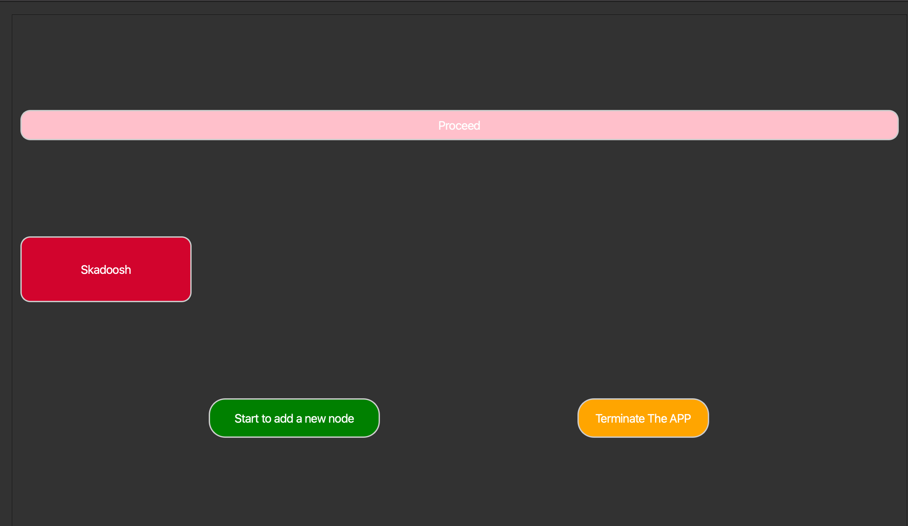

# Graph2Neo4jDB: Import your CSV, build your Neo4j graph, and link nodes—your way!

**#### Graph2Neo4jDB2.0 is a tool for importing CSV file data into a Neo4j database and building your own knowledge graph. It features a simple UI and essential functions (with new features continuously in development).**

## Current Features:

All the features below are supported by a simple UI, so you don't have to write code every time you import your nodes—that's the whole point of this tool.

1. Batch Import for Similar CSVs: Easily import multiple CSV files representing the same node type.
2. Node Relationship Mapping: Establish and customize relationships between nodes.
3. One-Click (Skadoosh) Bulk Import: Import a large set of nodes with configurations and data in a single action.
4. Under Construction... 🚧 (More powerful features coming soon!)### Import your own nodes from csv file
### Import your own nodes from csv file

